# Introduction
LIFESIGHT is an app where patients and doctors can connect, in a seamless, unified interface where patients can track their wearable health data in one place, AI can analyse trands and interperet a  user's healthcare/lifestyle/fitness goals. Strong consent mechanisms in place, and sharing controls will be present in the app.

Patients can upload health data that includes
- sleep patterns
- heart rate
Patients can also link their doctor and GP to their account.
Patients should also have access control on this data, and be able to decide what they want shared.
Doctors can manage multiple patients where the doctor can see the shared data.

Doctors and Patients should also have a chat history with the AI.
Doctors will be able to have a central dashboard for multiple patients, and AI will periodically analyse if patient's health is critical or in an emergency state.

# Tech stack

The project will use:
- React as the frontend
- Fastapi as the backend
- PostgreSQL as the RDBMS

Everything will be seperated into docker containers.

## Database design (mermaid format)

```mermaid
erDiagram
    User ||--o{ Patient : "is a"
    User ||--o{ Doctor : "is a"
    User ||--o{ OrganisationUser : belongsTo
    User ||--o{ Consent : gives
    User ||--o{ ConversationParticipant : participates
    User {
        int id PK
        string fullname
        string email UK
        string passwordHash
        enum userType "patient, doctor, admin"
        timestamp createdAt
        timestamp lastLogin
        boolean isActive
    }
    
    Patient {
        int id PK, FK
        date dateOfBirth
        string emergencyContactName
        string emergencyContactPhone
        string bloodType
        string insuranceMemberId
        string insuranceProvider
        timestamp updatedAt
    }
    
    Doctor {
        int id PK, FK
        string licenseNumber UK
        string specialization
        string qualifications
        boolean isLicensed
        timestamp verifiedAt
        boolean isGP
        string practiceName
        string gmcNumber UK
    }
    
    Organisation {
        int id PK
        string name
        enum organisationType "hospital, clinic, insurance, research, pharmacy"
        string address
        string phone
        string email
        string registrationNumber
        timestamp createdAt
    }
    
    OrganisationUser {
        int organisationId PK, FK
        int userId PK, FK
        enum role "employee, affiliated, member"
        string department
        timestamp joinedAt
        timestamp leftAt
        boolean isActive
    }
    
    PatientDoctor {
        int patientId PK, FK
        int doctorId PK, FK
        enum relationshipType "primary, specialist, consulting, emergency"
        timestamp connectedSince
        timestamp endedAt
        boolean isActive
    }
    
    DataConsent {
        int id PK
        int patientId FK
        int grantedToId FK
        enum grantedToType "doctor, organisation, research"
        timestamp grantedAt
        timestamp expiresAt
        enum consentStatus "active, revoked, expired"
        timestamp revokedAt
        string revocationReason
    }
    
    ConsentDataType {
        int consentId PK, FK
        enum dataType PK "sleep, heart_rate, demographics, medications, allergies, lab_results"
        enum accessLevel "view, download, share_with_third_party, use_for_research"
        boolean isConsented
    }
    
    SleepData {
        int id PK
        int patientId FK
        int consentId FK
        date recordDate
        int durationMinutes
        int deepSleepMinutes
        int remSleepMinutes
        int lightSleepMinutes
        int awakeMinutes
        int qualityScore
        int interruptions
        string sourceDevice
        timestamp recordedAt
        enum dataStatus "active, archived, deleted"
    }
    
    HeartRateData {
        int id PK
        int patientId FK
        int consentId FK
        timestamp recordedAt
        int bpm
        int restingBpm
        int minBpm
        int maxBpm
        enum context "resting, active, sleeping, stressed, post_exercise"
        string sourceDevice
        enum dataStatus "active, archived, deleted"
    }
    
    Conversation {
        int id PK
        enum conversationType "patient_ai, doctor_ai, patient_doctor, group_consultation"
        string title
        timestamp startedAt
        timestamp lastMessageAt
        boolean isActive
    }
    
    ConversationParticipant {
        int conversationId PK, FK
        int participantId PK, FK
        enum participantType "user, ai"
        timestamp joinedAt
        timestamp leftAt
        enum participantStatus "active, left, removed"
    }
    
    Message {
        int id PK
        int conversationId FK
        int senderId FK
        enum senderType "user, ai"
        text content
        timestamp sentAt
        boolean isRead
        timestamp readAt
    }
    
    DataAccessAudit {
        int id PK
        int patientId FK
        int accessedById FK
        enum accessedByType "doctor, organisation, system, patient"
        int consentId FK
        enum accessType "view, download, modify, delete, share"
        string dataType
        json dataIds
        string purpose
        timestamp accessedAt
        string ipAddress
        string userAgent
    }
    
    EmergencyAccess {
        int id PK
        int patientId FK
        int doctorId FK
        timestamp accessedAt
        string reason
        int approvedById FK
        timestamp approvedAt
        timestamp expiresAt
        json dataAccessed
        enum status "pending, approved, expired, revoked"
    }
    
    Patient ||--o{ SleepData : generates
    Patient ||--o{ HeartRateData : generates
    Patient ||--o{ PatientDoctor : has
    Patient ||--o{ DataConsent : manages
    Doctor ||--o{ PatientDoctor : treats
    Doctor ||--o{ EmergencyAccess : requests
    DataConsent ||--o{ ConsentDataType : includes
    DataConsent ||--o{ DataAccessAudit : "logs access for"
    SleepData ||--o{ DataAccessAudit : "is accessed via"
    HeartRateData ||--o{ DataAccessAudit : "is accessed via"
    Conversation ||--o{ Message : contains
    Conversation ||--o{ ConversationParticipant : has
    Organisation ||--o{ OrganisationUser : has
    Organisation ||--o{ DataConsent : "receives consent from"
```

# Coding Conventions

we're going to implement JWT token authentication to this fastapi backend
You should comment everything you do so I can learn from this, and so that it's easy to read

You should use Functional programming paradigms where possible
